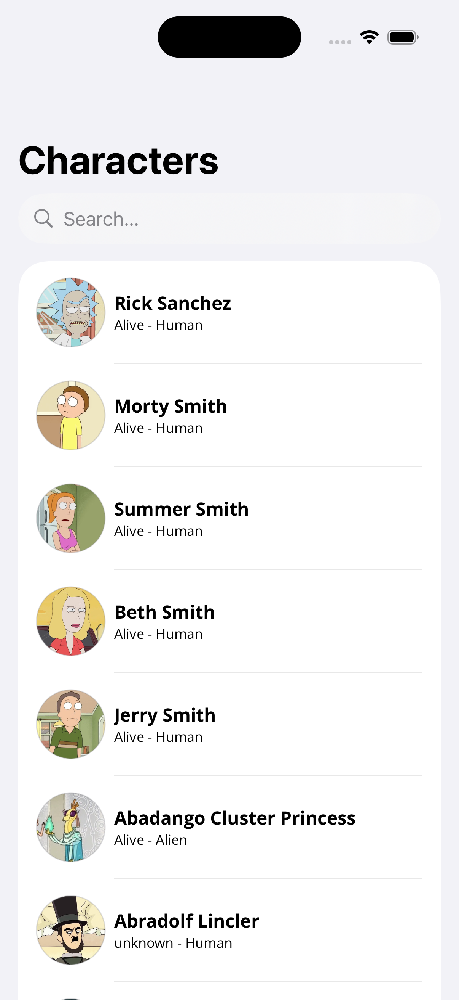
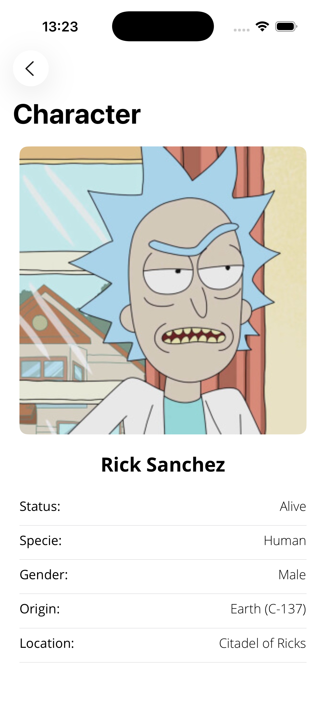
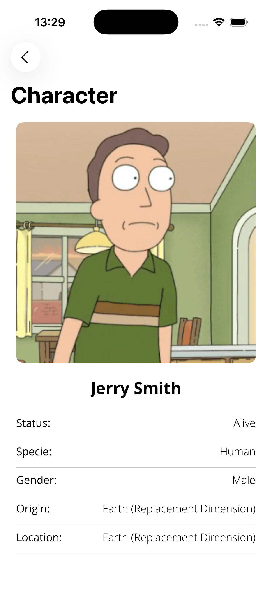

# Rick & Morty

Aplicación iOS que permite listar, buscar y visualizar los personajes de la serie *Rick and Morty*, utilizando la API REST oficial: [https://rickandmortyapi.com](https://rickandmortyapi.com).
  

  
  
  

## Características principales
- Desarrollo en **Swift**
- Diseño de interfaces con **SwiftUI**
- Arquitectura basada en **Clean Architecture**
- Patrón **MVVM (Model-View-ViewModel)**
- Uso de **async/await** para la gestión de llamadas asíncronas
- Configuración de entornos y esquemas de desarrollo (**Production**, **Staging**)
- Modularización mediante **Swift Package Manager (SPM)**, separando las capas en paquetes locales: *Data*, *Domain* y *Presentation*
- Uso de **Strings Catalogs** para la localización de la aplicación
- Implementación de **Unit Tests** con *XCTest*
- Sistema centralizado de estilos (fuentes, colores y temas)
- Patrón de diseño **Router** para el desacoplamiento de la navegación

## Librerías de terceros
- **Factory**: Inyección de dependencias — [https://github.com/hmlongco/Factory](https://github.com/hmlongco/Factory)
- **Kingfisher**: Descarga y caché de imágenes — [https://github.com/onevcat/Kingfisher](https://github.com/onevcat/Kingfisher)

## Estructura del proyecto
La estructura del proyecto se organiza en las siguientes carpetas principales:

- **App**: Contiene el punto de entrada de la aplicación, los archivos de configuración, fuentes, inyección de dependencias, localización y otros recursos de soporte.  
- **Components**: Componentes reutilizables, configuraciones de estilo y extensiones comunes.  
- **Features**: Cada una de las funcionalidades principales de la aplicación.  
- **Modules**: Contiene los paquetes locales de SPM correspondientes a las capas de *Clean Architecture*: *Data*, *Domain* y *Presentation*.

## Paquetes locales (SPM)
El proyecto utiliza **Swift Package Manager** con paquetes locales para lograr una modularización completa y un fuerte desacoplamiento entre las capas que componen la arquitectura limpia.

Cada paquete incluye su código fuente en la carpeta *Sources* y las pruebas unitarias en la carpeta *Tests*.

- **Data**: Contiene todo lo relacionado con el acceso y manejo de datos (*DataSources*, *Repository Implementations*).  
- **Domain**: Incluye la lógica de negocio (*UseCases*, *Repository Protocols*, *Entities*).  
- **Presentation**: Define la lógica de presentación (*ViewModels*).
